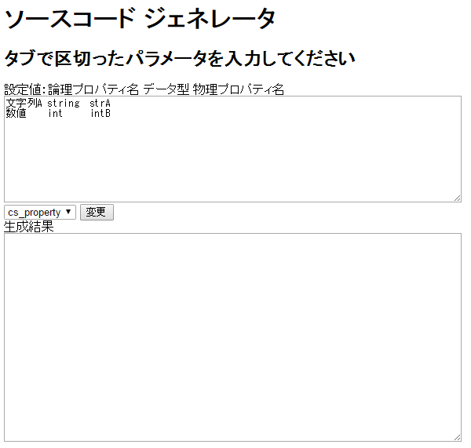

# はじめに
「オフィスツールで作成された設計書や仕様書を元にソースコードを自動生成したい」  
「ランタイムが必要だったりビルド環境が必要なのは使いづらい」  
「Webサービスを使うと情報を入れるので使えない環境もある」  
という観点でHTMLとJavaScriptでソースジェネレーターを作ってみました。  

[https://github.com/kazenetu/blog-reports/tree/master/reports/09-JS-SourceGenerator](https://github.com/kazenetu/blog-reports/tree/master/reports/09-JS-SourceGenerator)をさらに発展させたものとなっています。


# 利用方法
1. ソースコードを[https://github.com/kazenetu/blog-reports/blob/master/reports/09-JS-SourceGenerator/source/index.html](https://github.com/kazenetu/blog-reports/blob/master/reports/09-JS-SourceGenerator/source/index.html)をダウンロードしてください。

1. ダウンロードしたファイルをブラウザで開いてください。


1. 画面上部のテキストエリアにタブで区切った文字列をペーストしてください。  
※ヒントは上の「設定値：」以下を参考にして下ください。

1. 画面中央のドロップダウンを選択し、「変換」ボタンをクリックしてください。

1. 画面下部のテキストエリアに変換結果が出力されます。  
コピーしてご利用ください。  

# 拡張方法
[source/index.htmlの43行以降のformatsオブジェクト]https://github.com/kazenetu/SourceGenerator/blob/master/index.html#L43-L55)を下記のように拡張します。    
``` javascript
formats.ドロップダウン名 = new Object();
// 設定値の説明
formats.ドロップダウン名.text = "論理プロパティ名 データ型 物理プロパティ名";
// 設定値の数
formats.ドロップダウン名.count = 3;
// フォーマット {数字} にタブ区入りされた値が設定されます
formats.ドロップダウン名.format = '/// <summary>'+'\n'+
            '/// {0}'+'\n'+
            '/// </summary>'+'\n'+
            'public {1} {2} {set; get; }'+'\n';
// '0000'などを入力するとゼロ入り番号を設定できます(参考：java_property.formatArgs)
// {インデックス} と同じ順番で定義します
formats.ドロップダウン名.formatArgs = [
  null,
  null,
  null
];
```

# おわりに
ちょっとしたツールを作ってみました。  
お仕事のお役に立てれば幸いです。  
